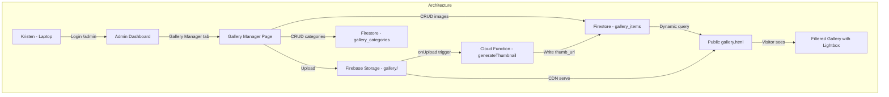

# Dynamic Gallery Management System — Full Specification

> **Project**: Baked By Bostik  
> **Author**: Architect (Planning Chat, Feb 15, 2026)  
> **Status**: Approved — Ready for Engineer

---

## Problem Statement

The gallery currently contains **316 unique images** (138MB) across **7 categories**, all **hardcoded into a 4,792-line static HTML file** (`gallery.html`). The gallery was generated by Python scripts (`generate_gallery.py`, `inject_gallery.py`) that scan local image folders. Images live on Dave's local Mac at `assets/images/Gallery/` and are deployed as static hosting files — **Firestore and Firebase Storage are not involved.**

Kristen (the business owner) has zero ability to manage gallery photos remotely. Any change requires physical access to Dave's Mac, editing files, and redeploying.

### Goal
Give Kristen a secure, desktop-friendly interface within the existing admin dashboard to **upload, delete, categorize, reorder, and hide gallery images** — with changes reflected on the public gallery immediately.

---

## Dedup Analysis (Completed)

The local filesystem contains 913 image files, but analysis confirmed:

| Metric | Count |
|--------|-------|
| Total files on disk | 913 |
| "All" folder (entirely duplicates of other folders) | 306 |
| Unique file only in "All" | 1 (`cupcakes-blue-white-baby-shower-boy.jpg`) |
| Images in exactly 1 category folder | 24 |
| Images in exactly 2 category folders | 291 |
| **True unique images** | **316** |
| Deduplicated size | **138MB** |

**Root cause**: The folder-based system forces physical file copies when images belong to 2 categories (e.g., a cowboy cake in both `Animals & Pets/` and `Cakes/`).

**Fix**: Multi-category tagging — one file, one Firestore doc, `categories` array.

---

## Data Model

```
Collection: gallery_items
Document: {
  id:            auto-generated
  image_url:     string      // Firebase Storage download URL (full size)
  thumb_url:     string      // Thumbnail URL (generated by Cloud Function)
  storage_path:  string      // e.g. "gallery/cowboy-cake.jpg"
  categories:    string[]    // e.g. ["animals", "cakes"] — MULTI-SELECT
  display_name:  string      // e.g. "Cowboy Birthday Cake"
  tags:          string      // comma-separated descriptive tags
  sort_order:    number      // for custom drag-and-drop ordering
  visible:       boolean     // default true — hide without deleting
  uploaded_at:   timestamp
  uploaded_by:   string      // "kristen@bakedbybostik.com"
}

Collection: gallery_categories
Document: {
  id:            auto-generated
  slug:          string      // e.g. "animals" (used in code/filters)
  label:         string      // e.g. "Animals & Pets" (displayed to users)
  sort_order:    number      // order in filter bar
  created_at:    timestamp
}
```

### Existing Category Slugs to Seed

| Slug | Label | Current Image Count |
|------|-------|-------------------|
| `cakes` | Cakes | 68 |
| `cookies` | Cookies | 235 |
| `animals` | Animals & Pets | 15 |
| `holidays` | Holidays & Celebrations | 126 |
| `kids` | Kids & Characters | 73 |
| `life` | Life Events | 62 |
| `school` | School & Sports | 27 |

---

## Architecture



---

## Existing Tech Stack (Reference)

- **Firebase Project ID**: `bakedbybostik-5eb55`
- **Auth**: Email/password via Firebase Auth (admin only)
- **Firestore Collections**: `requests`, `customers`, `orders` (gallery is NEW)
- **Storage Paths**: `requests/`, `quotes/` (gallery is NEW)
- **Cloud Functions**: `createQuotePDF`, `dispatchQuoteEmail`, `scheduledWeeklyReport`
- **Admin SPA**: `admin/index.html`, `admin/admin.js`, `admin/admin.css`
- **Firebase Config**: `js/firebase-config.js`
- **Firebase Init**: `js/firebase-init.js`
- **Hosting**: Root directory deploy (firebase.json `public: "."`)
- **Gallery JS**: `js/gallery.js` (filter, pagination, lightbox logic)
- **Gallery HTML**: `gallery.html` (4,792 lines, needs full rewrite)
- **Python Scripts**: `generate_gallery.py`, `inject_gallery.py` (to be deleted after migration)

---

## Phase 1: Data Layer + Dedup Migration Script

### Firestore Rules Update (`firestore.rules`)
Add to existing rules:
```
// Gallery Items - Public read, Admin write
match /gallery_items/{itemId} {
  allow read: if true;
  allow write: if request.auth != null;
}

// Gallery Categories - Public read, Admin write
match /gallery_categories/{catId} {
  allow read: if true;
  allow write: if request.auth != null;
}
```

### Storage Rules Update (`storage.rules`)
Add to existing rules:
```
// Gallery Images - Public read, Admin write
match /gallery/{allPaths=**} {
  allow read: if true;
  allow write: if request.auth != null;
}
```

### Migration Script
Write `scripts/migrate_gallery.js` (Node.js, uses Firebase Admin SDK):

1. **Initialize** Firebase Admin with service account
2. **Scan** the 7 category folders under `assets/images/Gallery/` (skip "All" folder entirely since 306/307 are duplicates)
3. **Build dedup map**: `{ filename → [category1, category2] }` — 315 entries
4. **Add the 1 unique "All" file**: `cupcakes-blue-white-baby-shower-boy.jpg` → assign a sensible category (likely "life" or ask Kristen)
5. **For each unique file** (316 total):
   - Upload to Firebase Storage at `gallery/{filename}`
   - Get download URL
   - Extract `display_name` from filename: remove extension, replace dashes with spaces, title case
   - Extract `tags` from filename: split by dash, title case, comma-join
   - Create Firestore doc in `gallery_items` with all fields
6. **Seed `gallery_categories`** with the 7 slugs/labels from the table above
7. **Log results**: count of uploaded files, any errors

**Important**: The image files currently live at:
```
/Users/davebostik/Desktop/BBB Website/assets/images/Gallery/
├── All/              (307 files — SKIP, all duplicates except 1)
├── Animals & Pets/   (15 files)
├── Cakes/            (68 files)
├── Cookies/          (235 files)
├── Holidays & Celebrations/ (126 files)
├── Kids & Characters/ (73 files)
├── Life Events/      (62 files)
└── School & Sports/  (27 files)
```

---

## Phase 2: Admin Gallery Manager UI

Add a "Gallery" page to the existing admin dashboard SPA. This follows the same patterns as the existing pages (Requests, Customers, Analytics).

### Requirements
- **Desktop-only** — no mobile optimization needed for admin UI
- **Single user** — Kristen is the only admin
- **Nav item**: Add "Gallery" to sidebar in `admin/index.html` (with a camera/image icon)
- **Page section**: `#page-gallery` in the main content area

### Category Manager (Sub-Section)
- List all categories from `gallery_categories` collection
- Each row: label, slug, image count, sort order
- "Add Category" button → inline form (label auto-generates slug)
- Edit label / reorder categories / delete category (with confirmation if images exist)

### Image Grid
- Thumbnail cards (use `thumb_url` if available, else `image_url`)
- Each card shows: thumbnail, display name, category badges, action buttons (edit ✏️, hide 👁️, delete 🗑️)
- Filter tabs generated from `gallery_categories` (same as public gallery)
- Stats bar: total image count, per-category counts
- "Load More" pagination (or infinite scroll)

### Upload Flow
- Drag-and-drop zone + file picker (multi-file support)
- Category multi-select dropdown (pick 1 or more categories per image)
- Auto-generate `display_name` and `tags` from filename (editable before upload)
- Progress bar for uploads
- Upload to Firebase Storage → create Firestore doc → image appears in grid

### Delete Flow
- Single: click delete icon on card → confirm dialog → delete from Storage + Firestore
- Bulk: checkbox select multiple → "Delete Selected" button → confirm → batch delete

### Edit Flow
- Click edit icon on card → modal with:
  - Display name (text input)
  - Tags (text input)
  - Categories (multi-select checkboxes)
  - Visibility toggle
- Save updates Firestore doc → changes reflected in public gallery immediately

### Visibility Toggle
- Eye icon on each card
- Click toggles `visible` field in Firestore
- Hidden images show with reduced opacity in admin grid
- Hidden images do NOT appear on public gallery

### Drag-and-Drop Ordering
- Within filtered view, drag images to reorder
- Persist `sort_order` field to Firestore on drop
- Public gallery respects `sort_order` (ascending)
- Kristen can put her best work at the top

---

## Phase 3: Rewrite Public Gallery to Be Dynamic

### `gallery.html` Changes
- **Remove**: All ~4,500 lines of hardcoded `<div class="gallery-item">` elements
- **Keep**: Page structure (head, header, nav, footer, lightbox modal shell)
- **Remove**: Hardcoded filter buttons
- **Add**: Empty container `<div class="gallery-grid" id="gallery-grid"></div>` for dynamic rendering
- **Add**: Empty container `<div class="gallery-filters" id="gallery-filters"></div>` for dynamic filter buttons
- **Add**: Loading skeleton/shimmer CSS for the gallery grid
- **Result**: File goes from ~4,800 lines to ~200 lines

### `js/gallery.js` Rewrite
- **On page load**:
  1. Query `gallery_categories` (ordered by `sort_order`) → render filter buttons dynamically (with "All" always first)
  2. Query `gallery_items` where `visible == true`, ordered by `sort_order` ascending
  3. Render `<div class="gallery-item">` elements from Firestore docs
  4. Use `thumb_url` for grid images, `image_url` for lightbox full-size view
- **Filtering**: Click filter button → re-query or client-side filter by `categories` array (use `array-contains`)
- **Pagination**: "Load More" button, use Firestore `limit()` + `startAfter()` for cursor-based pagination
- **Lightbox**: Same behavior as today — click image → lightbox with full-size, title, tags, "Request Like This" button
- **URL params**: Keep `?theme=cakes` deep-link support
- **Loading state**: Show skeleton cards while Firestore query is in-flight

### `js/firebase-init.js` Updates
- Ensure Firestore query methods used by gallery.js are exported (may need `orderBy`, `limit`, `startAfter`, `arrayContains`)

---

## Phase 4: Thumbnail Generation Cloud Function

### `functions/index.js` — New Function: `onGalleryUpload`
- **Trigger**: `onObjectFinalized` for Storage path `gallery/` (exclude `gallery/thumbs/`)
- **Action**:
  1. Download the uploaded image
  2. Resize to 400px width using `sharp` npm package (maintain aspect ratio)
  3. Upload thumbnail to `gallery/thumbs/{filename}`
  4. Get thumbnail download URL
  5. Find the matching `gallery_items` Firestore doc (by `storage_path`)
  6. Update the doc's `thumb_url` field

### `functions/package.json`
- Add `sharp` dependency

---

## Phase 5: Deploy, Test, Cleanup

### Deploy
```bash
firebase deploy --only firestore:rules,storage:rules,functions,hosting
```

### Verification Checklist
| Test | Expected Result |
|------|----------------|
| Migration complete | 316 Firestore docs, 316 Storage files, 7 categories |
| Admin: Upload new image | Appears in admin grid + public gallery within seconds |
| Admin: Delete image | Disappears from both admin and public |
| Admin: Change category | Image appears under new filter on public gallery |
| Admin: Drag-and-drop reorder | Order persists, public gallery reflects new order |
| Admin: Create new category | New filter button appears on public gallery |
| Admin: Hide image | Hidden from public gallery, visible (dimmed) in admin |
| Public: Filter by category | Only matching images shown |
| Public: Load More | Additional images load correctly |
| Public: Lightbox | Full-size image opens with "Request Like This" |

### Cleanup
- Delete: `generate_gallery.py`, `inject_gallery.py`, `gallery_items.html`
- Consider removing `assets/images/Gallery/` from hosting deploy (add to `firebase.json` ignore)
- Update project `implementation_plan.md` and `changelog.md`
